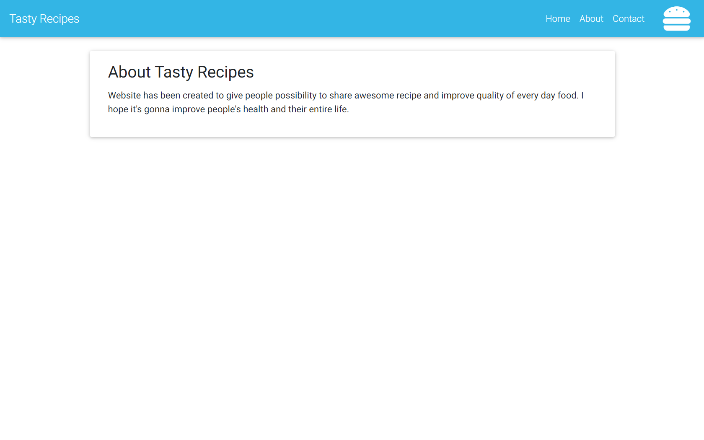

# RecipeApp

Spring Boot (ver. 2.1.6) web application (MVC) project.

Project has been initialized with Spring Initializr https://start.spring.io/

### Technologies and Maven dependencies used in project
* Maven - Project Management
* Intellij IDEA Ultimate
* JDK 8
* Thymeleaf
* H2 database
* MySQL
* Lombok
* JUnit 4
* Mockito
* JaCoCo
* Checkstyle
* Commons-lang3

#### Chosen screenshots
<kbd></kbd>

<kbd></kbd>

<kbd></kbd>

<kbd></kbd>

<kbd></kbd>

<kbd></kbd>

<kbd></kbd>
